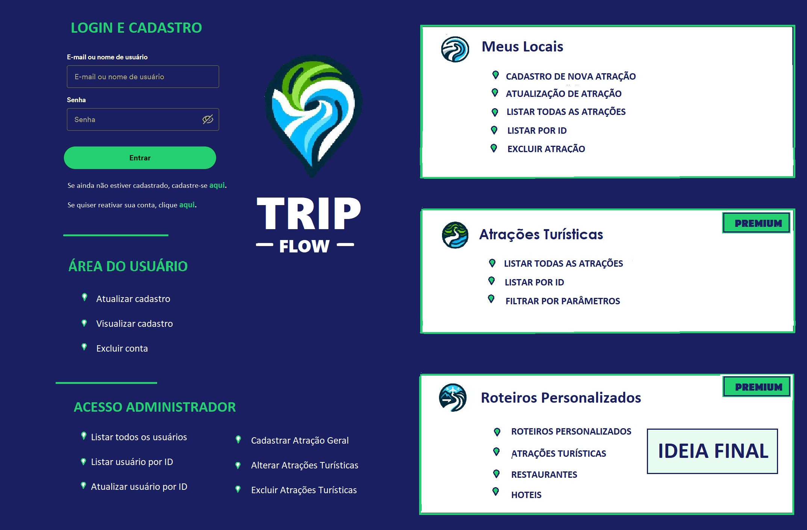

# TRIP FLOW

## Sobre a construção da API

### Apresentação da API TRIP FLOW 
Trata-se de uma plataforma para promover viagens sustentáveis e experiências positivas para os usuários, fornecendo acesso a informações sobre destinos turísticos, praias, atrações naturais e atividades recreativas.

Os usuários podem explorar e descobrir novos destinos, encontrar dicas de viagem sustentável, compartilhar suas experiências e avaliações, inclusive quanto à acessibilidade e coleta de lixo seletiva.
 
Assim, o usuário terá como guardar todos os locais visitados e avaliados, para poder acessá-las futuramente e até mesmo compartilhar experiências com amigos.

As funcionalidades incluem o cadastro de novos usuários, listagem, edição e seleção de destinos, visualização de informações dos destinos, entre outras.

Este projeto é uma solução simples e eficiente voltada ao turismo sustentável para facilitar a criação de roteiros de viagens e compartilhamento de experiências entre os viajantes.

Este é apenas o MVP, sendo que a proposta final da API busca atender à dificuldade dos usuários em planejar viagens a partir de uma plataforma que traga roteiros individualizados de viagem, incluindo atrações turísticas, hoteis e restaurantes, a partir das seleções feitas pelos usuários e considerando as avaliações dos demais usuários.

   ### API desenvolvida em Node.js 
   O projeto de backend desta API Rest foi construído com a linguagem de programação JavaScript, com utilização do ambiente de execução Node.js e do framework Express. A ORM escolhida foi o Sequelize, para facilitar e dar segurança ao relacionamento com o banco de dados PostgreSQL. 

   ### ESTRUTURA DA API 
   A API é construída seguindo os princípios RESTful, que definem a forma como as requisições e respostas HTTP devem ser formatadas, garantindo a padronização da comunicação entre os clientes e o servidor. 

   Este projeto segue uma estrutura de organização baseada em funcionalidades e ajuda a manter o código organizado e fácil de navegar, além de facilitar o trabalho colaborativo com outros desenvolvedores. Na pasta src, constam as seguintes pastas:
   1. config: contém todos os arquivos de configuração do projeto, como configurações de banco de dados e variáveis de ambiente.
   2. controllers: traz os responsáveis por manipular as solicitações e respostas HTTP.
   3. database: contém tudo relacionado ao banco de dados, inclusive uma pasta com as migrations e outra com as seeders.
   4. middlewares: onde estão as funções middleware.
   5. models: traz os modelos, que definem a estrutura das tabelas do banco de dados e as relações entre elas.
   6. routes: contém as rotas da aplicação, que definem os endpoints da API e como eles respondem às solicitações do cliente.
   7. schemas: contém as validações utilizadas pela middleware Yup.
   8. services:  Normalmente, os serviços contêm a lógica de negócios da aplicação. Aqui, foram inseridas as funções para interação com API externa.

## Papeis e Estrutura de Rotas
O projeto foi estruturado para que os usuários, a depender do seu tipo de permissão, pudessem utilizar as funcionalidades relacionadas ao Cadastro, ao setor de Atrações Turísticas Privadas de cada usuário e ao setor de Atrações Turísticas Gerais (esta com acesso restrito ao usuário Premium e ao administrador).

   ### Papeis:
   Criados os papeis via RBAC:

   1. Administrador - `admin`
   2. Usuário Comum - `user`
   3. Usuário Premium - `premiumUser`

  ### Rotas Relacionadas aos Usuários:

   1. Rota para Login  (`OBRIGATÓRIA`):
      * POST: `http://localhost:3000/user/login` 

   2. Rota para Cadastro de usuário (`OBRIGATÓRIA`):
      * POST: `http://localhost:3000/user` 

   3. Rota para Alteração do próprio Cadastro (`OPCIONAL`):
      * PUT: `http://localhost:3000/user` 

   4. Rota para Visualização do próprio Cadastro (`OPCIONAL`):
      * GET: `http://localhost:3000/user`

   5. Rota para Alteração do próprio Cadastro (`OPCIONAL`):
       * PUT: `http://localhost:3000/user`

   6. Rota para Exclusão do próprio Cadastro (`OPCIONAL`):
       * DELETE: `http://localhost:3000/user`

   7. Rota para Reativação de Cadastro de usuário (`OPCIONAL`):
       * PUT: `http://localhost:3000/user/reactivate` 

   8. Rota para Listar todos os Usuários Cadastrados (`OPCIONAL`):
       * GET: `http://localhost:3000/user/admin`

   9. Rota para Listar qualquer usuário por ID (`OPCIONAL`):
       * GET: `http://localhost:3000/user/admin/:id`

   10. Rota para alterar qualquer usuário por ID (`OPCIONAL`):
       * PUT: `http://localhost:3000/user/admin/:id`

   11. Rota para excluir qualquer usuário por ID (`OPCIONAL`):
       * DELETE: `http://localhost:3000/user/admin/:id`

  ### Rotas Relacionadas às Atrações Privadas dos Usuários:

   1. Rota para Cadastro de nova Atração Turística Privada (`OBRIGATÓRIA`):
     * POST: `http://localhost:3000/local` 

   2. Rota para Listar os locais cadastrados pelo próprio usuário (`OBRIGATÓRIA`):
      * GET: `http://localhost:3000/local`

   3. Rota para Listar atração específica cadastrada pelo próprio usuário (`OBRIGATÓRIA`):
       * GET: `http://localhost:3000/local/:id`

   4. Rota para Alteração de atração específica cadastrada pelo próprio usuário (`OBRIGATÓRIA`):
       * PUT: `http://localhost:3000/local/:id `

   5. Rota para Exclusão de atração específica cadastrada pelo próprio usuário (`OBRIGATÓRIA`):
       * DELETE: `http://localhost:3000/local/:id `

  ### Rotas Relacionadas às Atrações Gerais – acesso restrito: 

   1. Rota para Cadastro de nova Atração Turística Geral (`OPCIONAL`):
     * POST: `http://localhost:3000/attraction` 

   2. Rota para Listar todos as atrações turísticas cadastradas (`OPCIONAL`):
      * GET: `http://localhost:3000/attraction`

   3. Rota para Listar atração turística específica (`OPCIONAL`):
       * GET: `http://localhost:3000/attraction/:id`

   4. Rota para Filtrar atração turística por parâmetro (`OPCIONAL`):
       * GET: `http://localhost:3000/filter`

   5. Rota para Alteração de qualquer atração turística (`Opcional`):
       * PUT: `http://localhost:3000/attraction/:id `

   6. Rota para Exclusão de qualquer atração turística (`Opcional`):
       * DELETE: `http://localhost:3000/attraction/:id `

## Projeto Visual

## Configurar o repositório:

   ### Se quiser iniciar o repositório local:
   1. Cria uma pasta local e abre no VsCode
   2. Iniciar novo repositório local: `git init`

   ### Para copiar o repositório remoto:
   1. Copiar: `git clone https://github.com/Keeity/tripFlow`

## Variáveis de ambiente
   1. Criar arquivo `.env` com base no arquivo `.env_example`
   2. Preencher:
        * DIALECT=`dialeto do banco de dados utilizado`. Exemplo: `postgres`
        * HOST: `endereço do host do seu banco de dados`. Exemplo: `localhost`
        * USERNAMEDB: `nome de usuário usado para se conectar ao seu banco de dados`. Exemplo: `postgres`
        * PASSWORDDB: `senha usada para se conectar ao seu banco de dados`. Exemplo: `senha`
        * DATABASE: `nome do banco de dados ao qual você deseja se conectar`. Preencher com `viagem365`.
        * PORT: `porta na qual o seu banco de dados está escutando`. Exemplo: `5432`
        * PORT_API: `porta na qual a API estará rodando`. Exemplo: `3000`.
        * SECRET_WJT=`palavra chave escolhida para utilizar o jwt`. Exemplo: `senha`

## Rodar o repositório:

   ### Para começar a utilizar, é necessário instalar as dependencias (node_modules):
   1. `npm install`
   2. Se for em ambiente local: `npm install --dev`

   ### Para rodar o repositório em ambiente local
   1. `npm run start`

## Interagindo com banco de dados com migrations:

   ### Criar o banco de dados 
   1. Crie o banco de dados `viagem365`. 
   2. Fora do projeto, pode utilizar outros dialetos e ferramentas de administração de banco de dados, desde que especificado no `.env`.
  
   ### Rodar migration. Para criação das tabelas `users` e `attractions`:
   1. Opção nº 1: `sequelize db:migrate`
   2. Opção nº 2: `npx sequelize db:migrate`

   ### Incluir valores iniciais no banco de dados. Para popular as tabelas:
   1. Opção nº 1: `sequelize db:seed:all`
   2. Opção nº 2: `npx sequelize db:seed:all`
   
## Rodar o repositório:

   ### Para rodar o repositório em ambiente local
   1. `npm run start`

## Para testar a API TripFlow

   ### Documentação da API TripFlow:
   * Para acessar a documentação completa das rotas, acesse a rota do servidor /doc ou, se a porta da API for 3000, pelo link direto `http:localhost:3000/doc`.

  ### Para acessar as rotas como usuário comum (`user`), utilizar para login:
   * email: `joao.silva@example.com`
   * password: `Joao18`

  ### Para conseguir as rotas como usuário premium (`premiumUser`), utilizar para login:
   * email: `carlos.oliveira@example.com`
   * password: `Carlos20`

  ### Para conseguir acessar todas as rotas como administrador(`admin`), utilizar para login uma das opções abaixo:

   * email: `rawan@example.com`
   *  password: `Rawan15`

   * email: `keeity@example.com`
   *  password: `Keeity17`

## Outras Documentações Úteis:

   ### Documentação do Sequelize: 
   `https://sequelize.org/docs/v6/core-concepts/model-basics/`

   ### Documentação do JWT: 
   `https://jwt.io/`

   ### Documentação do Swagger: 
   `https://swagger-autogen.github.io/docs`

## Links da API

   ### Repositório do GITHUB
   `https://github.com/Keeity/tripFlow`

   ### Vídeo apresentando a API
   `https://drive.google.com/drive/folders/16a9quxXQQgaB_z5XDtPawqGLHiwmGjyV`

 